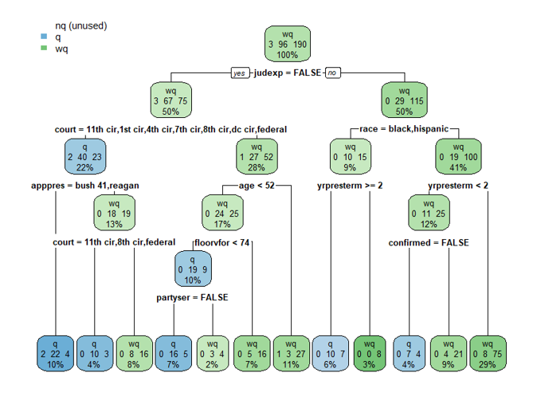
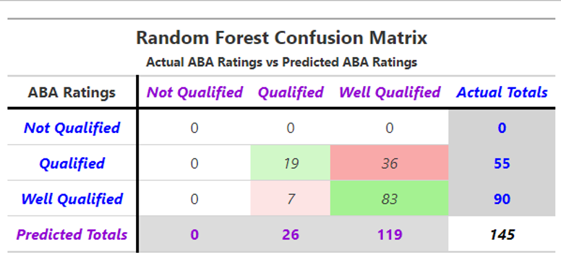
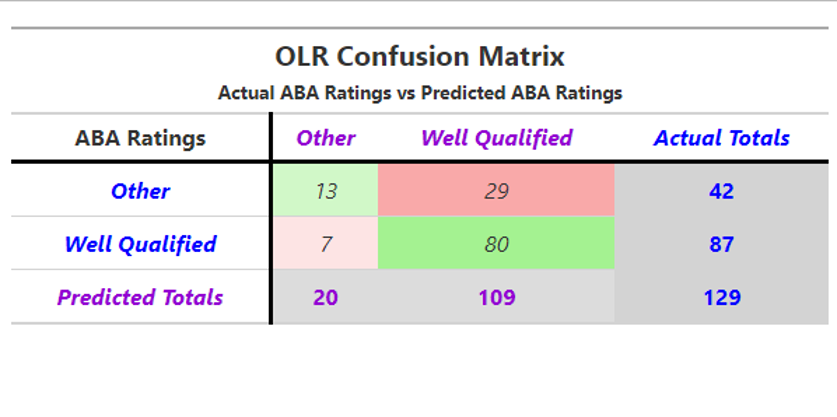
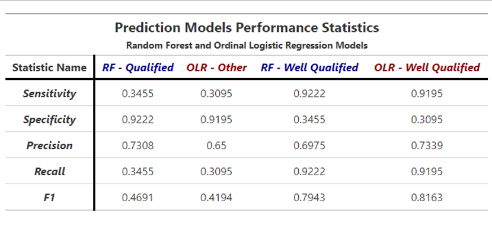

# Undergraduate Capstone Project: Building Models to Predict Ratings of Federal Judicial Nominees

## Introduction
- **Client:** University of Georgia - Political Science Department

- **Context:** When a vacancy arises in the Federal Judiciary, the President of the United States appoints a candidate to fill the position. The American Bar Association (ABA) assigns one of three ratings to the nominee: Not Qualified, Qualified, or Well Qualified.

## Objective
Analyze potential correlations between ABA ratings and various demographic or professional factors of judicial nominees—including age, sex, race, geographic location, appointment year, prior work experience, and political affiliation. Additionally, develop a predictive model to assess these relationships and forecast future ABA ratings for judicial appointments.

## Methodology
- **Random Forest:** An ensemble learning method that constructs multiple decision trees and combines their outputs to improve prediction accuracy and reduce overfitting. It is commonly used for classification and regression tasks.

- **Ordinal Logistic Regression (OLR):** A statistical modeling technique designed for predicting an ordinal dependent variable, where the response categories have a meaningful order but unequal spacing. It extends logistic regression to handle ordered outcomes.

## Results
### **Random Forest:**
- The figure below illustrates a single decision tree.
- With each additional split, the decision tree becomes more specific, progressively improving the classification accuracy by isolating data points based on relevant feature thresholds.
- In this case study, the Random Forest Algorithm used 50,000 decision trees to train the model and make predictions.

- The confusion matrix below compares the predicted results from the Random Forest model to the actual data.
- The model achieved an overall accuracy of 70%, though it shows a bias towards predicting 'Well Qualified'.
- Since there were only three 'Not Qualified' ratings in the dataset, none of them appeared in the randomized test set, which likely influenced the bias in the model.
- The most significant variables influencing the algorithm (ranked by Gini Index) were court type, age, and previous experience as a district court judge.

---

### **Ordinal Logistic Regression (OLR):**
- The confusion matrix below compares the predicted results from the OLR model to the test data subset.
- LASSO regression was used for feature selection due to the large number of variables. After selection, 24 predictor variables remained in the model, reduced from an initial 110 variables in the full dataset.
- The model achieved an overall accuracy of 72%.
- Variables such as age, years in state or district court, and years of experience in various positions all have positive coefficients, indicating that the older a nominee is and the more experience they have, the greater the likelihood of receiving a “Well Qualified” rating.
- Conversely, affiliation with the Federalist Society or being a member of a minority political party showed negative coefficients, suggesting a lower likelihood of receiving a “Well Qualified” rating.

---

### Model Results Compared

## Conclusions
- **Key Findings:** Through the Random Forest and Ordinal Logistic Regression (OLR) models, it was determined that certain variables—particularly age and prior experience as a District Court Judge—are strong predictors of receiving a “Well Qualified” ABA rating for judicial nominees. These findings suggest that experience within the judicial system plays a significant role in shaping professional qualifications, which is likely to be a key factor in the selection process.

- **Model Performance:** Both models achieved an accuracy of 72%. The Random Forest model demonstrated effectiveness in classifying nominations and provided valuable insights into the relationships between demographic and professional factors. The OLR model, enhanced by LASSO regression for feature selection, refined the predictors and revealed clear associations with the judicial rating.
  
- **Practical Implications:** The results can assist policymakers, legal advisors, and political figures by offering data-driven insights into the characteristics that may influence a judicial nominee's evaluation. The predictive capabilities of these models can be utilized to identify patterns in future judicial nominations and inform decision-making processes.

## Future Improvements
- **Expansion of Sample Size:** Increasing the sample size would be beneficial for enhancing the robustness and generalizability of the analysis, allowing for more reliable conclusions.

- **Incorporating More Recent Data:** The current dataset spans from 1977 to 2008. Including nominations from 2009 to the present (2023) would allow for a more up-to-date analysis and enable comparisons between historical and current trends using the same methodologies.

- **Broader Scope of Data:** The analysis is currently limited to U.S. Court of Appeals nominations. Expanding the dataset to include nominations for all federal judgeships would provide a more comprehensive view and allow for a broader application of the same analytical techniques.
