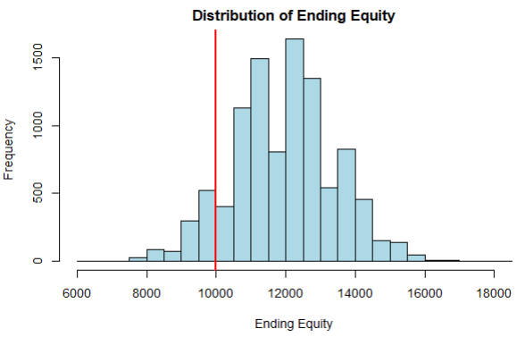

# Trading Risk Analysis Project

## 📚Introduction
In recent years, retail short-term trading has surged in popularity, attracting many new traders eager to capitalize on market opportunities. However, a significant number enter the market with little to no understanding of risk management, proper position sizing, or trading psychology. Many overleverage their accounts, exposing themselves to excessive risk and often depleting their funds before they have a chance to develop the fundamental skills needed for long-term success.

To sustain a trading career, it is essential to not only assess risk on individual trades but also understand cumulative risk over weeks, months, and years. Without this awareness, traders may fall into emotional decision-making, leading to panic-driven trades and unexpected financial setbacks. Professional traders prioritize risk management above all else, ensuring they remain within their risk tolerance and focused on refining their strategies. Adopting this mindset is critical for any trader aiming for long-term profitability and consistency in the market.

## 🎯Objective
- Develop a simulation-based tool that allows traders to assess their **long-term risk exposure** based on their past performance metrics.

- The tool should output key risk metrics like:
  - Distribution of outcomes, highlighting the range of possible results
  - Probability of account ending in profit or loss
  - Confidence intervals for potential ending balances
  - Maximum potential equity drawdown and gain
  - Maximum potential consecutive wins and losses

- By shifting the focus from individual trade results to long-term risk assessment, traders can make informed decisions about position sizing and risk tolerance. This helps traders avoid unexpected large drawdowns, ensuring they stay within their risk parameters and maintain a professional, process-driven mindset.

## 🧪Methodology
**Data Collection:** The data required for the tool must be collected by the user. This can be done either manually through tracking in an Excel sheet or by utilizing automated journaling software that pulls data directly from the user's brokerage account via API. The key inputs needed for the simulation are:
  - **Number of trades:** Total trades executed by the user during a given time period.
  - **Average realized reward-to-risk ratio:** The ratio between the average gain and average loss on each trade.
  - **Win percentage:** The percentage of trades that resulted in a profit.
 
**Model/Simulation Setup:**
- The model is based on a **Monte Carlo Simulation** approach, where thousands of trade scenarios are simulated using random sampling to estimate the distribution of potential outcomes for the trader's account equity.
- **Stochastic Modeling** is employed, where trade outcomes (win or loss) are randomly generated based on known probabilities (win probability), and account equity is adjusted based on these outcomes and the defined reward-to-risk ratio.
- The simulation considers **Expected Values** principles by using the win probability and the reward-to-risk ratio to model potential outcomes over a large number of trades.

## 📊Example: Implementation and Interpretation
**Step 1: Define Inputs**
```r
starting_capital = 10000  #Starting account balance of $10,000
risk_per_trade = 100  #Risk $100 per trade
win_probability = 0.40  #40% win rate
reward_to_risk_ratio = 2  #2:1 R/R ratio
num_trades = 100 #Number of trades to simulate
```

**Step 2: Run Simulation**



```text
Percentage Ending in Drawdown: 9.97 %
Percentage Ending in Profit: 90.03 %
Max Equity Drawdown: 32.81 %
Max Equity Gain: 76 %
95% Confidence Interval of Ending Equity: 9100 14800 
Max Consecutive Wins: 10 
Max Consecutive Losses: 14
```

**Step 3: Interpret Results**
- **Percentage Ending in Drawdown:** 9.97% of the simulations resulted in a loss. This reflects the inherent risk in trading, but the relatively low percentage suggests that, with proper risk management, this trader is likely to avoid losses over time.

- **Percentage Ending in Profit:** 90.03% of the simulations resulted in a gain. This indicates that this trader's strategy has a positive expectancy and a higher chance of yielding gains than losses.

- **Max Equity Drawdown:** The max drawdown of 32.81% indicates the loss experienced during the worst-performing simulation. It is essential for traders to be aware of such potential risks so they can dynamically adjust position sizing and risk management techniques to mitigate substantial drawdown periods.

- **Max Equity Gain:** The max gain of 76% showcases the best-case scenario for the trader, reflecting the potential for a strong return when trade conditions are favorable. This result emphasizes the upside potential of the strategy when executed correctly under ideal market conditions.

- **95% Confidence Interval of Ending Equity:** The range of $9,100 to $14,800 represents the expected bounds within which the trader's account equity is likely to end up, with 95% certainty, after completing the set number of trades. This interval helps the trader understand the variability of their strategy in the long run.

- **Max Consecutive Wins:** The maximum consecutive wins (10) show the trader’s potential for streaks of success. It emphasizes the importance of capitalizing on winning trends while managing risk to maximize the potential of each favorable outcome.

- **Max Consecutive Losses:** The maximum consecutive losses (14) highlight the worst-case scenario where the trader experiences several losses in a row. This reiterates the need for sound risk management to ensure that a trader can survive a losing streak and avoid devastating losses that could deplete their account balance.

## 📝Conclusions and Future Improvements
- **Key Findings:** This tool offers traders a comprehensive way to evaluate their long-term risk exposure by simulating thousands of potential outcomes based on their past performance. By understanding the distribution of their account equity, traders can make informed decisions about position sizing and risk tolerance.

- **Implications for Traders:** For newer traders, this tool provides a much-needed framework to identify how overleveraging can impact long-term profitability. For experienced traders, it offers insights into fine-tuning risk management strategies and optimizing position sizes based on historical performance.

- **Limitations:** The model assumes constant risk/reward ratios and win percentages over time, which may not reflect the dynamic nature of the market. However, as the sample size of a trader’s data collection increases, the law of large numbers ensures that the estimated averages for win rate and risk/reward ratio become more statistically reliable. This reduces variance in the model’s inputs, leading to more accurate simulations that better reflect a trader’s true long-term performance.

- **Future Enhancements:** Future versions could include features such as more advanced risk metrics, customizable risk/reward scenarios, and the integration of 
 external market conditions. Additionally, linking directly to brokerage accounts for real-time performance tracking could further streamline the user experience.

- **Closing Statement:** This tool aims to bridge the gap between theory and practice by providing a clear, data-driven approach to risk management. With continued refinement, it has the potential to help traders of all levels make more informed decisions and improve their overall trading performance.
